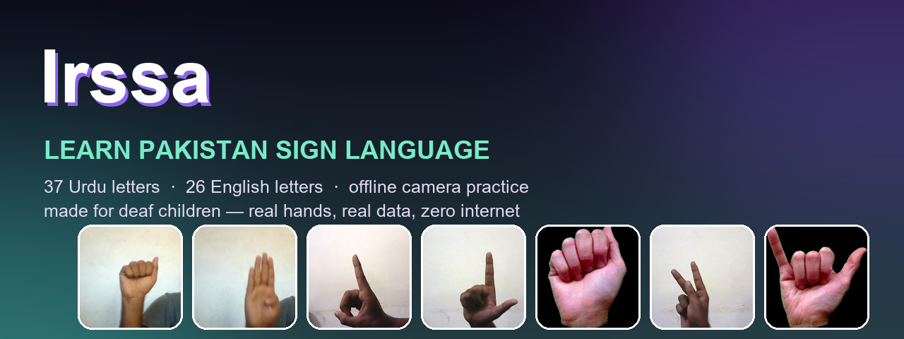
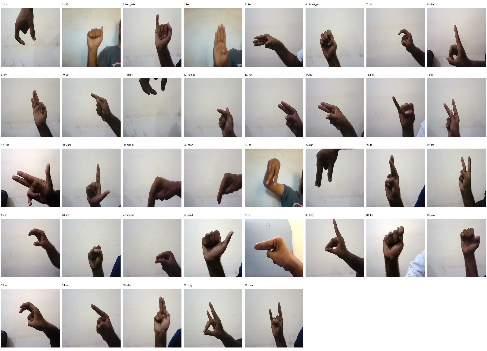

<div align="center">



# Irssa — ارسا 🌈

**پاکستان سائن لینگویج سیکھیں · Learn Pakistan Sign Language**

*A learning game for deaf and speech-impaired children — built with real hands,
real data, and a lot of love.* ❤️


Every deaf child deserves to see her language on a screen and think *"that's my hands."*
Irssa is built for that moment — the moment a letter finally clicks, the camera smiles,
and confetti falls. 🎉

</div>

---

## 📲 Download & install (no setup needed)

1. Open the [`apk/`](apk/) folder of this repository.
2. Download **`Irssa-v1.0-debug.apk`** onto any Android phone (Android 7.0 or newer).
3. Open the file and allow *"Install from unknown sources"* if your phone asks.
4. That's it — the app works **fully offline**. Nothing is ever sent anywhere.

> 🔒 **Her privacy comes first.** No accounts, no ads, no analytics. Camera frames are
> processed on the device and discarded instantly — her practice belongs to her alone.

---

## 💛 What's inside

### Two alphabets, two languages — clearly separated

- **اردو (PSL): 37 letters** — every letter taught with a real hand photograph,
  gentle step-by-step cues, and Urdu words she knows: **ا for انار** (pomegranate),
  **ب for بکری** (goat)…
- **English (ASL): 26 letters** — real photographs and English words, taught as a
  *different* language, because it is one. Never mixed, never confused.

### A camera that cheers for her 📸✨

An offline recognition coach watches her hand and celebrates when a sign is truly
formed — **37 PSL handshapes and 24 static English letters**. It is trained on real
hands from **independent signers** across multiple datasets, and tuned to prefer
saying *"take your time"* over a false *"you did it!"*. When the sign holds for
1.2 seconds: stars, haptics, confetti — success she can feel, not just hear.

### Numbers, words, and games 🔢🎮

- **Numbers 0–50 and everyday words** — guided practice, made to be learned together
  with a teacher or family.
- **Speed Match, quizzes, camera quests, stickers** — because learning should feel
  like playing.
- **Gesture converter & speech-to-sign** — type or speak a word and watch it
  finger-spelled, letter by letter.
- **A grown-ups area** — progress backup, daily goals, full media attribution, and
  honest notes about what the camera can and cannot do.

### Make it *hers*: teach the app her own hand ✋💖

Every hand is different. The single biggest accuracy upgrade is teaching the
recognizer *her* hand — 15 quiet minutes at a computer with a webcam:

```
tools/venv/Scripts/python.exe tools/capture_my_hand.py psl      # then: english
tools/venv/Scripts/python.exe tools/train_hybrid.py
```

Her hand enters the model weighted heavily, and the app starts understanding *her*.

### The 37 PSL handshapes



---

## 🔍 How the camera recognition works — honestly

- [Google MediaPipe Hand Landmarker](https://developers.google.com/edge/mediapipe/solutions/vision/hand_landmarker)
  finds 21 hand landmarks; a nearest-neighbour classifier trained on real hand
  landmarks names the letter.
- **English J and Z are guided practice** — they need motion, so a static model never
  pretends to grade them. Numbers and word signs need movement or both hands.
- The acceptance gate is deliberately strict, tuned on held-out data: the app would
  rather say *"not yet, try again"* than lie with a wrong *"you did it!"*.
- A camera match means *"that handshape looks like this letter"* — it is **never** a
  measure of the child's ability. She is always more than a score.

---

## 🛠️ Building the app yourself

1. Open the project in [Android Studio](https://developer.android.com/studio).
2. Let it sync (a `debug.keystore` is included, so the debug build signs itself).
3. Run on a device or emulator, or:

   ```
   ./gradlew assembleDebug
   ```

Reproducible training lives in `tools/`: landmark extraction, hybrid multi-signer
training (`tools/train_hybrid.py`), and evaluation results in
`docs/recognition-evaluation.json`. Design and licensing notes: `docs/RESEARCH.md`.

---

## 🙏 Real hands, credited with gratitude

This app stands on real hands and generous datasets:

- **Urdu/PSL hand photographs (signer 1):** Ali Imran Ali (2021), *"Data set about hand
  configuration of Pakistan Sign Language"*, Mendeley Data V1,
  [doi:10.17632/y9svrbh27n.1](https://data.mendeley.com/datasets/y9svrbh27n/1) — **CC BY 4.0**.
  Paper: Imran et al. (2021), *Data in Brief* 36, 107021.
- **PSL gesture landmarks (signer 2):** [Bakhtyar12/Pakistani-Sign-Language](https://huggingface.co/datasets/Bakhtyar12/Pakistani-Sign-Language),
  Hugging Face, **MIT** — landmark sequences for every Urdu letter, which made recognition
  honest across different hands.
- **English letters:** Ayush Thakur, [ASL Dataset](https://www.kaggle.com/datasets/ayuraj/asl-dataset) (**CC0**)
  and [SignAlphaSet](https://data.mendeley.com/datasets/8fmvr9m98w/1) (Mendeley, **CC BY 4.0**).
- **PSL learning resources:** [Deaf Reach / PSL Dictionary](https://psl.org.pk/) — the
  heart of PSL learning in Pakistan. Their videos are *not* bundled; the app links to
  them for guided practice, and we encourage families to learn directly from them.

*You can also train with private family recordings locally (e.g. a personal dataset like
the FESF dictionary materials) — the tools support it, and such data stays on your
computer, out of this repository, out of respect for its rights holders.*

---

## 🌍 Why Pakistan Sign Language

Language is identity. This edition teaches **Pakistan Sign Language** because that is
the language of Pakistan's Deaf community — with English fingerspelling taught
separately, as its own skill. Signs vary between regions and schools, so always confirm
what she learns here with her family and a fluent Deaf educator.

**A photograph can support a teacher. It can never replace one.** 💐

---

<div align="center">

*Made for curious hands and growing minds.* ✋🌱

**Irssa 2.0 · Free, offline, and made with love**

</div>
